>  ## Prequisites
> - Install [CMake](https://cmake.org/download/)
> - Install [Visual Studio](https://visualstudio.microsoft.com/) for Windows
> 	- Needed for Microsoft C++ toolset, not the IDE. CMake will generate build scripts that uses `cl.exe` compiler.
> - Install [Ninja](https://ninja-build.org/)
> 	- Well, I said this is needed, but you can use `Visual Studio 17 2022` for CMake Generator below.
> - Install [Visual Studio Code](https://code.visualstudio.com/Download)
> 	- Install [C/C++ Extension Pack for VS Code](https://marketplace.visualstudio.com/items?itemName=ms-vscode.cpptools-extension-pack). We can easily configure/generate CMake project.

## What is CMake?

> CMake is a tool to manage building of source code. Originally, CMake was designed as a generator for various dialects of `Makefile`, today CMake generates modern buildsystems such as `Ninja` as well as project files for IDEs such as Visual Studio and Xcode.

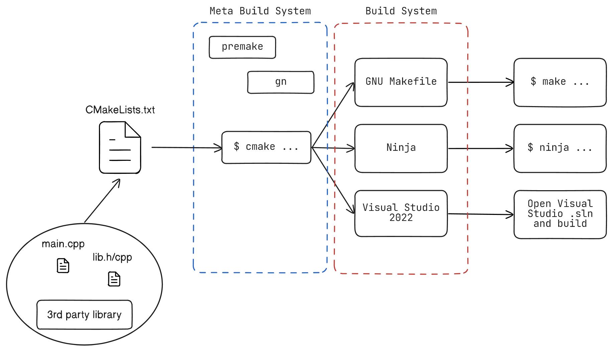
Basically, **CMake** is a platform independant meta-build system that generates build script such as `GNU Make, Ninja` or even Visual Studio project for Windows users.

CMake will generate build scripts based on the project's `CMakeLists.txt` and generator options(`-G` option for `cmake` CLI).

For example `$ cmake -G "Visual Studio 17 2022" -Bbuild` will create Visual Studio 2022 project inside `build/` directory. Then all you need to build the actual executable is to run `$ cmake --build build` from project's root directory.

## Why use CMake?

Yeah, I know CMake is really weird and difficult when using it for the first time. For heavy projects, commercial grade IDE like Visual Studio is convenient and efficient. However for smaller toy projects, I am too lazy to boot up Visual Studio. **Visual Studio Code** feels much lighter, and even more customizable than Visual Studio.

Plus, you cannot use Visual Studio for C++ in Mac OSX envrionment, since their Visual Studio is mainly for developing `.NET` programs. Since university assumes every students are working with Windows environment, coding in C/C++ in Mac OSX without Visual Studio IDE was pretty difficult. Going through all of those obstacles helped me learn about build systems in C/C++ world.

Especially in my Computer Graphics class, professor used `WIN32 API + (immediate mode) OpenGL` for the class. He gave us Visual Studio projects for assignments and example codes. In order to try those sample codes in my MacBook, I HAD to learn about build systems. *(Well, I used my Windows desktop at home for assignments tho lol)*

These are some of problems I had.

- I have to include bunch of `.cpp/.h` files into the compiler.
- I have to link `GLFW` library since I can't use `WIN32 API` in Mac OSX, obviously.
- Then I have to compile+link all these stuffs in order to run sample graphics program.

This is where CMake kicked in. I just needed to type in what source codes should I include in my program, what library should I link to, etc. Then a simple command would generate and build my program.

## VS Code + CMake + MSVC

> Make sure you have all the prequisites mentioned above.

### 1. 📁&#xFE0F; Open a new VS Code project

Create an empty folder and open Visual Studio Code from that directory.

### 1.5 ⚙&#xFE0F; Configure CMake Extension

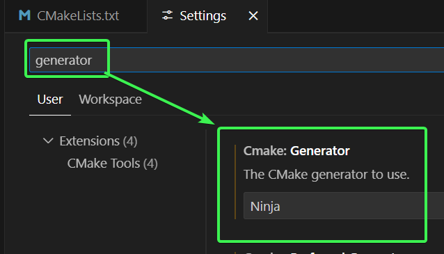

In VS Code settings, search `generator` and use `Ninja` for `Cmake:Generator`. We are going to generate Ninja build script for our C++ project. You can use other build systems if you want. 

> [List of cmake-generators](https://cmake.org/cmake/help/latest/manual/cmake-generators.7.html)

You can add this setting (`"cmake.generator": "Ninja"`) to the local `.vscode/settings.json` configuration so that you can change it locally, instead globally.

### 2. 📄&#xFE0F; CMakeLists.txt and CMake configuration

Create a new file named `CMakeLists.txt` in current folder's root. Then enter the following two lines.

```cmake
cmake_minimum_required(VERSION 3.30)
project("My First Project")
```

`cmake_minimum_required(...)` sets the minimum required version of cmake for a project. If someone else is building this project, they are going to need at least minimum version of CMake specified here.

`project(...)` gives a name for the project.

> According to [cmake 3.30 - project(...)](https://cmake.org/cmake/help/latest/command/project.html#project), you can specify more options inside `project()`.

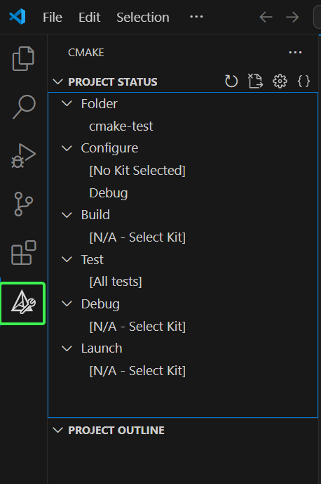

After creating `CMakeLists.txt`, check the sidebar. If you don't see CMake extension icon, try closing VS Code and reopen it. 

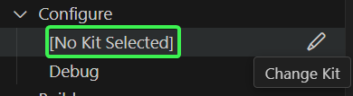

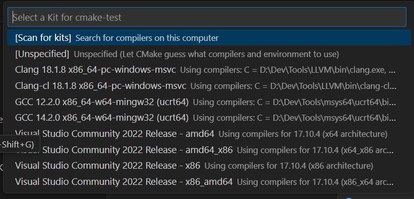

Clicking ✏ Icon next to `Configure - [No Kit Selected]` will show list of tookits in your pc. For me, I have `gcc, clang, cl`. We are going to choose `Visual Studio Community 2022 Release - amd64`. This one means we are going to build `from: x64 PC - compile for: x64 PC`.

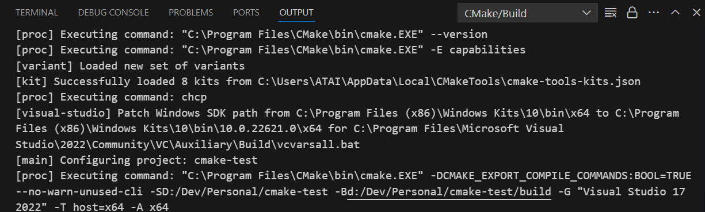

Configuration log will appear at Output window. By default, build scripts will be generated in `build/` directory. You can configure this in VS Code's CMake extension setting.
asdf

### 3. 📄Our `main.cpp`

```cpp
// main.cpp
#include <iostream>

int main()
{
    std::cout << "Hello World!" << std::endl;
}
```

Now we can write our source code. Then we need to add `main.cpp` to our CMake project. Append a following line into your `CMakeLists.txt`

```cmake
# CMakeLists.txt
cmake_minimum_required(VERSION 3.30)
project("My First Project")

# add ALL of the source codes needed to build our program.
add_executable(main main.cpp)
```

`add_executable(<executable_name> source_codes ...)` adds executable to the project using specified source codes, this case `main.cpp`. Therefore our binary output file will be named `main.exe`.

When you hit save, VS Code will automatically re-configure the CMake project.

### 4. 🚀 Let's build!

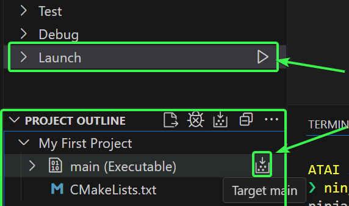

Then you can either launch or just build by pressing those buttons in CMake sidebar.

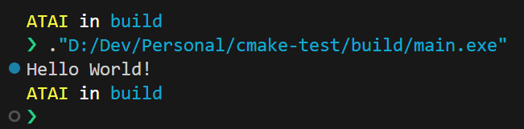

Inside `build/` directory, our build output `main.exe` will be built. Then try running it. There you go! We have created our first CMake project!

> Using commandline for building
> The command `cmake --build build` from project's root will also build our project.
{: .prompt-tip }

### 5. 😏Extra: VS Code Intellisense

If your Intellisense stops working, such as autocompletion being totally broken, check the configuration.

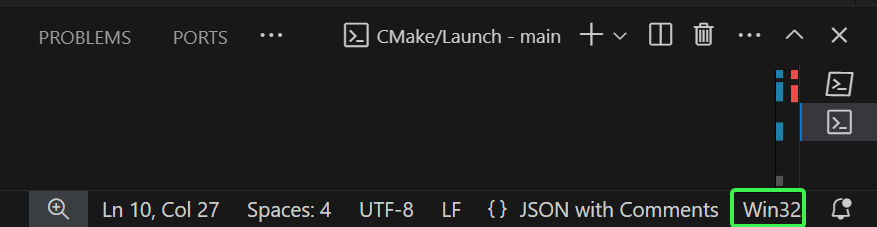

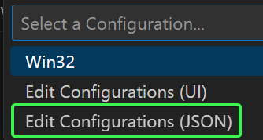

To configure Intellisense(Autocompletion), press `Win32` button at the right bottom corner of VS Code. Then open JSON configuration. It will generate `.vscode/c_cpp_properties.json` in your project directory. Then you can configure intellisense settings here.

```js
{
  "configurations": [
    {
      "name": "Win32",
      // ...
      "configurationProvider": "ms-vscode.cmake-tools"
    },
  ],
  "version": 4,
}
```

Make sure you have `"configurationProvider": "ms-vscode.cmake-tools"` in the JSON file. This will enable more accurate Intellisense based on CMake project rather than default C/C++ Extension Intellisense.

#### Alternative: clangd 

You can use [clangd VS Code Extention](https://marketplace.visualstudio.com/items?itemName=llvm-vs-code-extensions.vscode-clangd) intellisense instead of C/C++ extension's one. Although you need to install `clangd`. Check [clangd installation](https://clangd.llvm.org/installation).

After installing LLVM and clangd Extention, you will see bunch of warnings pop up.

```js
{
  // ...
  "C_Cpp.intelliSenseEngine": "disabled",
}
```

Disable C/C++ Extension's IntelliSense engine from settings(UI) or add the following line to your local `.vscode/settings.json`

This will disable C/C++ extension's intellisense in our workspace. When you don't want to use `clangd` intellisense, disable the clangd extension and revert the configuration to `"C_Cpp.intelliSenseEngine": "default"`.

```cmake
# CMakeLists.txt
cmake_minimum_required(VERSION 3.30)
project("My First Project")

# >>> export build flags so that clangd knows about our project!
set(CMAKE_EXPORT_COMPILE_COMMANDS 1)

# add ALL of the source codes needed to build our program.
add_executable(main main.cpp)
```

Then in your project's `CMakeLists.txt`, add `set(CMAKE_EXPORT_COMPILE_COMMANDS 1)`. Now you are ready to use `clangd` as your main IntelliSense!

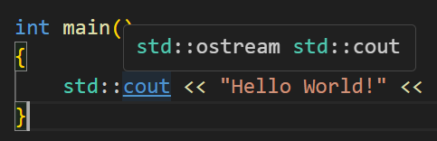

This is the default C/C++ extension's IntelliSense, hovered onto `cout` object.

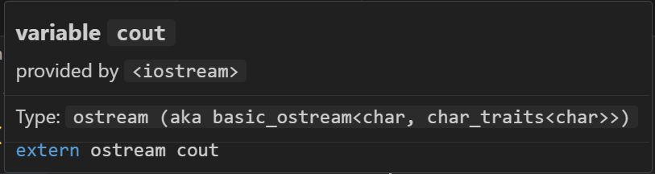

This is `clangd` IntelliSense, hovered onto the same `cout` object.
