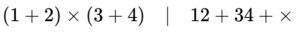
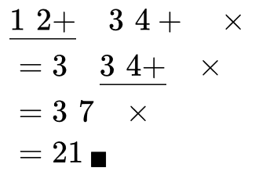
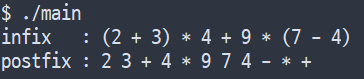
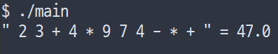

## 🔎 후위표기식?
{: w="600" h="70"}
_중위표기법(좌)과 후위표기법(우)_

우리가 수식을 작성할 때, 두 숫자 사이에 연산자를 적어 두 숫자를 연산한다. 이처럼 연산자를 가운데에 적는 표기법을 **중위표기법 (Infix)** 이라한다. 반면에 컴퓨터에 중위표기법으로 수식을 입력하면 이를 후위표기식으로 변환하여 연산한다. 두 피연산자를 먼저 적고 나중에 연산자를 뒤이어 적는 방법을 **후위표기법 (Postfix, Reverse polish notation)**이라고 한다.

{: w="350" h="200"}
_후위표기식 계산법_
위 그림에서와 같이 후위표기식의 계산법은 왼쪽에서 오른쪽으로 이동하며 계산한다. 괄호나 곱셈, 나누기 등 연산자의 우선순위가 높은지 따질 필요도 없이 왼쪽에서 오른쪽으로 읽어가며 바로 계산이 된다.

컴퓨터가 (중위표기식으로부터) 후위표기식을 만들어내는 것과 후위표기식을 계산해내는 것에 우리가 공부한 스택 자료구조가 사용된다. 이번글에서는 스택을 사용해 중위표기식을 후위표기식으로 변환하는 방법과 후위표기식을 계산하는 방법을 공부해본다.

## 🔄 중위 → 후위표기식으로 변환

> 참고 : [영문 위키피디아 - 후위표기식 변환 알고리즘](https://en.wikipedia.org/wiki/Shunting_yard_algorithm){: .target="_blank"}
{: .prompt-tip}

### 의사코드
```python
# expr : 입력 수식인 중위표기식
while (ch in expr)
    switch (ch)
    ################################   
        case 숫자:
            print(ch)
        
    ################################
        case 연산자:
            while (스택이 비어있지 않고 &&
                   스택 top 연산자의 우선순위가 같거나 높으면)
                print(pop())

            # 스택이 비었거나 현재 ch 연산자의 우선순위가 크다면
            push(ch)
        
    ################################
        case '(':
            push(ch)

    ################################
        case ')':
            while ( 스택 안에서 '(' 를 만나기 전까지 )
                print(pop())

            pop() # '(' 는 pop해서 그냥 버림

# 입력 수식의 문자를 다 탐색했다면 스택에 남은 연산자를 출력
while (스택이 비어있지 않은 동안)
    print(pop())
```
{: file="Pseudo code"}

의사코드를 보며 알고리즘을 이해해보자. 우선 입력 수식으로는 중위표기식만을 받는다. 
1. 수식에서 피연산자, 연산자 하나하나를 수식의 왼쪽부터 시작하여 비교한다.
2. 피연산자라면 바로 출력한다.
3. 연산자라면 스택의 top에 있는 연산자와 우선순위를 비교한다. 스택에 있는 연산자의 우선순위가 자신보다 낮아질 때까지 스택에서 pop하여 출력하고, 스택이 비게되었거나 내 우선순위가 커졌다 현재 연산자를 push한다.
4. 여는 괄호를 만났다면 스택에 push한다.
5. 닫는 괄호를 만났다면 스택에서 여는 괄호를 만날때까지 pop하여 출력하고, 마지막 여는 괄호는 버린다.

이렇게 해서 수식을 다 돌았으면 스택에 남은 나머지 연산자들을 pop하여 출력하면 끝이다.


### 구현코드
> 이전에 작성한 동적 스택을 변형하여 사용합니다. [pastebin 보러가기](https://pastebin.com/uBXus6as){: target="_blank"}
{: .prompt-info}

우선 문자열의 길이만큼 반복문을 돌아야하므로 `strlen()` 함수를 사용하기 위해 `string.h` 헤더를 포함시켜준다. 이후 스택 요소의 자료형인 `element`도 이번에는 문자형으로 다루기때문에 `typedef char element`로 수정해준다. (4번째 줄) 
알고리즘이 도는 동안 스택의 구조를 출력하고 싶다면 `stack_print()` 함수도 맞게 수정해주면 된다. 아니라면 주석처리 하면 된다.

```c
int operator_order(char op)
{
    switch (op)
    {
        // 덧셈, 뺄셈은 "낮은" 우선순위
        case '+':
        case '-':
            return 1;

        // 곱셈, 나누기는 "높은" 우선순위
        case '*':
        case '/':
            return 2;

        // 피연산자나 기타 문자는 0으로 처리
        default:
            return 0;
    }
}

void infix_to_postfix(const char* expr)
{
    int len = strlen(expr); // 수식의 길이
    char ch, op;

    DynStack s;
    stack_init(&s);

    // 입력 수식의 길이만큼 반복
    for (size_t i = 0; i < len; ++i)
    {
        ch = expr[i];
        switch (ch)
        {
            case '+': case '-': case '*': case '/':
                while (!stack_isEmpty(&s) &&
                       operator_order(ch) <= operator_order(stack_peek(&s)))
                    printf("%c ", stack_pop(&s));

                stack_push(&s, ch);
                break;

            case '(':
                stack_push(&s, ch);
                break;

            case ')':
                while (stack_peek(&s) != '(')
                    printf("%c ", stack_pop(&s));

                stack_pop(&s);
                break;

            case ' ':
                break;

            default:
                printf("%c ", ch);
                break;
        }
    }

    while (!stack_isEmpty(&s))
        printf("%c ", stack_pop(&s));

    printf("\n");
    stack_free(&s);
}

int main()
{
    const char* s = "(2 + 3) * 4 + 9 * (7 - 4)";
    printf("infix\t: %s\n", s);
    printf("postfix\t: ");
    infix_to_postfix(s);

    return 0;
}
```

{: w="360" h="80"}
_실행결과_

구현은 위에서 본 의사코드와 똑같이 구현하면 된다. 다만 이 코드의 문제점은 수식을 토큰단위로 (피연산자, 연산자 단위) 자르는것이 아니라 문자 한개 단위로 잘라 사용하기 때문에 2자리 이상의 숫자에 대해서는 대응하지 못한다. 하지만 간단한 사칙연산을 동반한 수식 정도는 잘 변환하기 때문에 후위표기식을 공부하는 데에는 크게 문제 없을 것이다.

## 🧮 후위표기식의 계산
### 의사코드
```python
while (ch in expr)
    if (ch == 피연산자)
        push(ch)
    else # 연산자라면
        lhs = pop()
        rhs = pop()
        push(lhs ch rhs) # lhs와 rhs 값을 연산자 ch로 연산하여 push

result = pop() # 종료 후 스택에 남아있는 값이 계산 결과
```
{: file="Pseudo code"}

후위표기식을 계산하는 방법은 비교적 간단하다. 피연산자를 만나면 스택에 push하고, 연산자를 만났다면 스택에서 2개를 pop해 연산자와 연산을 진행하여 그 결과를 스택에 push한다. 맨 마지막에 스택에 남아있는 값이 후위표기식의 계산결과이다.

### 구현코드
이를 구현하기 위해 앞서 사용한 동적 스택의 자료형을 `double` 형으로 바꾸어준다. (`typedef double element`)

```c
double evaluate(const char* expr)
{
    int len = strlen(expr);
    char ch;

    double num, rhs, lhs;

    DynStack s;
    stack_init(&s);

    // 수식의 길이만큼 반복
    for (size_t i = 0; i < len; ++i)
    {
        ch = expr[i];

        // 공백은 스킵
        if (ch == ' ')
            continue;
        // ch가 피연산자일때
        else if (ch != '+' && ch != '-' && ch != '*' && ch != '/')
        {
            num = ch - '0'; // '0' 을 빼면 문자에서 정수 자료형으로 바뀐다.
            stack_push(&s, num);
        }
        // ch가 연산자일때
        else
        {
            // 2, 3, + = 2 + 3이므로 스택에 나중에 들어간 숫자가 우 피연산자이다.
            // 우 피연산자 -> 좌 피연산자 순서로 pop
            lhs = stack_pop(&s);
            rhs = stack_pop(&s);
            switch (ch)
            {
                case '+':
                    stack_push(&s, rhs + lhs);
                    break;
                case '-':
                    stack_push(&s, rhs - lhs);
                    break;
                case '*':
                    stack_push(&s, rhs * lhs);
                    break;
                case '/':
                    stack_push(&s, rhs / lhs);
                    break;
                default:
                    break;
            }
        }
    }
    
    // 반복을 끝내고 스택에 남아있는 값이 계산결과
    double result = stack_pop(&s); 
    stack_free(&s);

    return result;
}

int main()
{
    const char* expr = "2 3 + 4 * 9 7 4 - * +";
    printf("\" %s \" = %3.1lf\n", expr, evaluate(expr));

    return 0;
}
```

{: w="400" h="70"}
_실행결과_

이 방법 또한 문자 한개 단위로 반복문을 돌기 때문에, 두자리 이상의 숫자는 지원하지 않는다. 간단한 숫자와 연산자를 섞어서 다양한 결과를 출력해보자.


## ⭐정리
- 스택을 사용하여 중위표기식을 후위표기식으로 바꾸는 방법을 배웠다.
- 스택을 사용하여 후위표기식을 계산하는 방법을 배웠다.

---
참고서적 : C언어로 쉽게 풀어쓴 자료구조 (개정 3판), 천인국·공용해·하상호, 생능출판 - [Yes24바로가기](https://www.yes24.com/Product/Goods/69750539){:target="_blank"}
