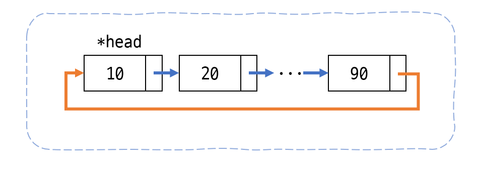
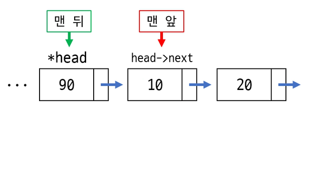

## 🔍 원형 연결리스트(Circular linkedlist)란?


_원형 연결리스트_

지난 시간에 알아본 단순 연결리스트는 리스트에 끝에 도달하면 뒤로 되돌아갈 수 없다는 단점을 가지고 있다. 이를 개선하여, 리스트에 끝을 다시 리스트의 맨 앞과 연결하는 형태로 만든 리스트를 **원형 연결리스트**라고 한다. 잘 생각해보면 원형 큐와 모습이 비슷하다.

어떤 데이터들을 계속 순회하며 써야할 때가 있다. 예를 들면 온라인 보드게임이 있다고 하자. 플레이어 1 ~ 4 까지의 차례가 끝나면, 다시 플레이어 1의 차례가 되어야한다. 이를 원형 연결리스트를 사용한 큐로 관리하면 편할 것이다. 플레이어가 언제 떠나거나 새로 들어올 지 모르기때문에, 배열을 사용한 큐보단 자유자재로 노드를 삽입하고 제거하는 원형 연결리스트로 구현한 큐를 쓰는 것이다.

## 💡 원형 연결리스트의 구현

> [!tip] 여기서는 리스트의 맨 앞, 뒤에 삽입, 제거하는 동작만 설명한다.  
> 원하는 위치에 요소를 삽입하고, 원하는 위치의 요소를 제거하는 동작은 똑같다. 인덱스를 세며 리스트를 탐색하다가 원하는 자리에 도달하면 삽입, 제거 동작을 진행하면 된다. 노드의 연결에 주의하며 진행하면 된다.

교재에서는 리스트의 맨 끝을 `head`로 정의했다. 따라서 리스트의 맨 앞은 `head->next`가 된다.

### 리스트 맨 앞에 삽입하기


_맨 앞에 삽입_

리스트의 맨 앞에 새로운 요소를 삽입하는 과정은 이렇다.

1. 새 요소의 다음 노드를 헤드가 가르키는 다음 노드를 가르키게 하기.
2. 헤드가 다음 노드로 새 요소를 가르키게 하기.

이렇게 하면 리스트의 맨 앞인 `head->next`가 자연스럽게 새로 삽입된 요소가 된다.

```c title="main.c"
void List_InsertFirst(List* list, element item)
{
    // 헤더 구조체에서 리스트의 헤드 노드(리스트의 맨 뒤)를 가져온다.
    Node* head = list->head;

    // 삽입할 노드 생성
    Node* newNode = NULL;
    newNode = List_CreateNode(newNode, item);

    // 빈 리스트라면 맨 앞과 맨 뒤를 똑같이
    if (head == NULL)
    {
        head = newNode;
        head->next = newNode;
    }
    // 아니라면 위의 움짤의 순서대로 진행
    else
    {
        newNode->next = head->next;
        head->next = newNode;
    }

    // 수정된 헤드노드를 헤더 구조체에 다시 반영, 노드 개수 +1 하기
    list->head = head;
    ++list->size;
}
```

### 리스트 맨 뒤에 삽입하기

맨 뒤에 삽입하는 것은 아주 쉽다. 위의 맨 앞에 삽입하는 과정을 마치고, 리스트의 맨 끝을 가르키는 `list->head` 포인터를 새로 삽입한 요소를 가르키게만 하면된다. `InsertFirst()`과정을 마치면 일단 리스트의 노드를 원형으로 연결되어있다. 따라서 이후 `list->head = newNode` 로 헤드 포인터만 변경해주면 맨 끝에 삽입한 것이 된다.

```c title="main.c"
void List_InsertLast(List* list, element item)
{
    // 헤더 구조체에서 리스트의 헤드 노드(리스트의 맨 뒤)를 가져온다.
    Node* head = list->head;

    // 삽입할 노드 생성
    Node* newNode = NULL;
    newNode = List_CreateNode(newNode, item);

    // 빈 리스트라면 맨 앞과 맨 뒤를 똑같이
    if (head == NULL)
    {
        head = newNode;
        head->next = newNode;
    }
    // 아니라면 위의 움짤의 순서대로 진행
    else
    {
        newNode->next = head->next;
        head->next = newNode;
        head = newNode; // 새로 삽입한 노드를 리스트의 헤드 노드로!! (리스트의 맨 뒤)
    }

    // 수정된 헤드노드를 헤더 구조체에 다시 반영, 노드 개수 +1 하기
    list->head = head;
    ++list->size;
}
```

### 리스트의 맨 앞 요소 제거하기


_맨 앞 요소 제거하기_

리스트의 맨 앞을 제거하는 과정은 아래와 같다.

1. 헤드 노드의 다음 노드(맨 앞 노드)를 임시 저장한다.
2. 헤드 노드가 헤드 노드의 다음 다음을 가르키게끔 한다. 즉 리스트의 맨 뒤 노드가, 맨 앞 노드의 다음 노드를 가르키게 한다.
3. 임시 저장한 맨 앞 노드를 메모리에 반환한다.

```c title="main.c"
element List_RemoveFirst(List* list)
{
    Node* head = list->head;
    element e = -1; // 노드를 하나 제거해서 빈 리스트가 됐다면 -1 리턴

    // 빈 리스트일때
    if (head == NULL)
    {
        fprintf(stderr, "Cannot remove from an empty list!\n");
        exit(1);
    }
    // 리스트에 노드가 한개만 있을 때 제거하면 빈 리스트가 된다.
    else if (list->size == 1)
    {
        e = head->data;
        free(head);
        head = NULL;
        list->size = 0;
    }
    // 노드가 2개 이상일 때
    else
    {
        Node* removed = head->next;
        e = removed->data;
        head->next = removed->next;
        free(removed);
        --list->size;
    }

    list->head = head;

    return e; // 제거한 노드의 데이터 리턴
}
```

리스트의 맨 앞 요소를 제거할 때는 노드가 1개일때와 2개 이상일 때를 나누어 코드를 짜야한다. 한개일때 제거하면 빈 리스트가 되기 때문에 이를 고려해야한다.

> [!tip]
> 반면에 맨 뒤의 요소를 제거하는 과정은 선형 탐색이 필요하다. 맨 뒤 노드의 이전 노드(헤드 노드의 이전 노드)를 리스트의 맨 앞 노드 (헤드 노드의 다음 노드)에 연결해야하는데 현재 원형 연결리스트로는 결국에는 한바퀴 돌아야 맨 뒤로 돌아오기 때문이다.

## 💻 코드 전체

[pastebin 보러가기](https://pastebin.com/wAwKJDwK)


_출력 결과_

`1 ~ 3`은 `InsertFirst()`를 한 것이고, `4 ~ 6`은 `InsertLast()`를 한 것이다.

## ⭐정리

- 원형 연결리스트에 대해 알아보았다.
- 원형 연결리스트에서 맨 앞, 뒤에 삽입하고, 맨 앞 요소를 제거하는 방법을 구현하였다.

---

참고서적 : C언어로 쉽게 풀어쓴 자료구조 (개정 3판), 천인국·공용해·하상호, 생능출판 - [Yes24바로가기](https://www.yes24.com/Product/Goods/69750539)
