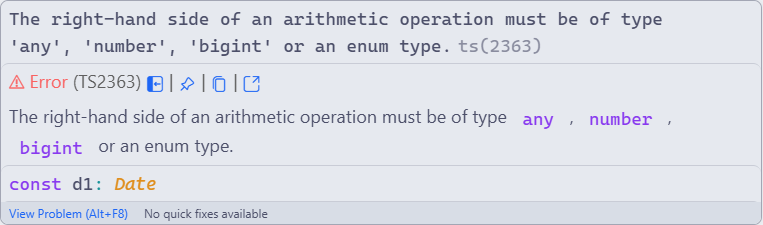
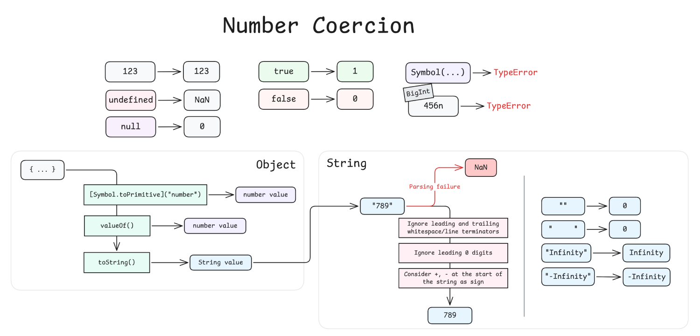

## 문제 상황

```ts title="pages/index.astro" del="pubDate"
const posts = (await getCollection("blog"))
	.sort((a, b) => a.data.pubDate - b.data.pubDate)
  //      타입 경고 발생:  ^~~~~~~          ^~~~~~~
	.map((post) => /* ... */);
```

Astro framework를 사용한 블로그를 만들면서 겪은 경험이다. `getCollection`을 사용하여 블로그 글을 목록 형태로 띄울 때, 글을 작성일 기준으로 정렬하려고 `sort` 함수를 사용했다.

{data-caption='자동완성을 사용할 때는 한 눈 팔지맙시다...'}

이때, GitHub Copilot의 자동 완성 때문이었는지, `Date` 타입의 객체를 과감하게 서로 빼서 정렬 기준값을 계산했다. 



`pubDate` 필드는 숫자 값이 아닌 `Date` 객체이었기에 TypeScript는 위와 같은 경고를 띄운다.

## 해결

```ts ins=".valueOf()"
.sort((a, b) => a.data.pubDate.valueOf() - b.data.pubDate.valueOf())
.map((post) => /* ... */)
```

`-` 연산 시, 명시적으로 `Date.prototype.valueOf()` 메서드를 호출하여 숫자 값끼리 빼기 연산이 되도록 하면 된다. `Date.prototype.valueOf()` 메서드는 1970년 1월 1일 자정으로부터 밀리초 단위로 센 타임스탬프 값, 즉 숫자 값을 반환한다.

## 배경지식

왜 TypeScript가 이런 경고를 띄우는지 알아보았다. 우선 JavaScript의 `-` 연산자의 특징에 대해 찾아보았다.

>[!info] 참고 문서
>- [Subtraction (-)](https://developer.mozilla.org/en-US/docs/Web/JavaScript/Reference/Operators/Subtraction)
>- [Numeric coercion](https://developer.mozilla.org/en-US/docs/Web/JavaScript/Guide/Data_structures#numeric_coercion)

`-` 연산자는 이런 특징들을 가진다:

- `Number` 타입과 `BigInt` 타입에 대해 두 가지 함수 중복(Overload)을 가진다.
- 연산 시, 우선 두 피연산자를 numeric coerce(number, bigint 타입으로 암시적 형 변환) 한다.
	- 이 과정은 아래에서 이야기 할 number coercion과 거의 유사하다. 단, 주어진 피연산자가 `BigInt`인 경우 `TypeError`를 발생시키지 않고 그대로 반환한다. 
- 변환된 타입의 두 피연산자가 서로 다른 타입이라면 `TypeError`를 발생시킨다.

여기서 두 피연산자를 `Number/BigInt` 타입으로 변환한다고 했다. 이는 객체 `Number`가 아닌 Primitive 타입 중 하나인 `number`를 의미한다. Primitive에 대해 잠깐 간단히 알아보자.

### Primitive Type

JavaScript에는 7가지 [Primitive](https://developer.mozilla.org/en-US/docs/Glossary/Primitive) 타입이 있다.

- string
- number
- bigint
- boolean
- undefined
- symbol
- null

Primitive 타입의 값들은 객체가 아니면서 메서드와 프로퍼티도 갖지 않는다. `-` 연산에 사용되는 두 피연산자 값을 숫자로 변환하는 행위는 primitive number/bigint 타입으로 변환해 보는 것과 같다.

참고로 Primitive 타입에는 메서드가 없는데, `"hello".includes("...")`와 같이 쓸 수 있는 이유는 Primitive 값의 메서드, 프로퍼티에 접근 시 해당 값이 대응하는 객체 버젼으로 자동 Boxing 되기 때문이다.

```ts
// = "hello".includes("ll");
(new String("hello")).includes("ll");
```

이런 식으로 주어진 Primitive 값을 대응되는 Built-in Object 형태로 포장하여 메서드를 호출한다.

### Type Coercion

>[!info] 참고 문서
> [Type coercion](https://developer.mozilla.org/en-US/docs/Glossary/Type_coercion)

MDN에 의하면 Type coercion이란 어떤 타입이 *자동으로 또는 암시적으로 다른 타입으로 변환*되는 것을 의미한다.

```ts
const msg = "Hello!";
const id = 123;
console.log(msg + id); // "Hello!123"
//             ^~~~ 
//       id 값을 number -> string으로 몰래 변환!
```

위 코드처럼 `+` 연산자에서 몰래 일어나는 형 변환을 찾아볼 수 있다.

Type Coercion에는 여러 종류가 있다. 

- Primitive 타입을 받는 곳에 들어온 값을 primitive 값으로 변환하는 **primitive coercion**
- 숫자를 받는 곳에 들어온 값을 숫자 값으로 변환하는 **number coercion**
- 이외에도 `null, undefined, symbol` 타입의 값을 제외하고 string, object, boolean coercion 등이 존재한다.

### Number coercion

>[!info] 참고 문서
>- [Number coercion](https://developer.mozilla.org/en-US/docs/Web/JavaScript/Reference/Global_Objects/Number#number_coercion)
>- [Numeric coercion](https://developer.mozilla.org/en-US/docs/Web/JavaScript/Guide/Data_structures#numeric_coercion)


`-` 연산을 위해 사용되는 number coercion 규칙에 대해 알아보자.

> 정확히는 *Numeric Coercion*. Number coercion과 다른 점은 변환 대상이 `BigInt`인 경우 `TypeError`를 발생시키지 않고 BigInt를 그대로 반환한다는 점이다.)

{data-caption='TLDR: Number coercion diagram'}

어떤 값을 숫자 값으로 변환하는 과정의 규칙은 아래와 같다:

1. 이미 숫자 값이라면 그대로 반환
2. `undefined`는 `NaN`이 된다.
3. `null`은 숫자 `0`이 된다.
4. `true`는 숫자 `1`, `false`는 숫자 `0`이 된다.
5. 문자열은 number literal만을 가졌다고 가정하고 파싱을 시도한다. 실패하면 `NaN`이 된다.
	- 시작과 끝의 공백문자는 일단 무시한다.
	- 문자열 앞에 채워진 숫자 `0`은 무시한다. 8진수로 읽혀지지 않는다.
	- `+`와 `-` 가 숫자 앞에 붙었다면 부호로 간주된다. 딱 하나만 와야하고, 숫자와 부호 사이에는 공백이 있으면 안된다.
	- `"Infinity"`와 `"-Infinity"`라는 문자열이라면 그대로 해석되어 무한대 값이 된다.
	- `""` (빈 문자열)이나 `"    "`(공백문자로만 이루어진 문자열)은 숫자`0`으로 간주된다.
	- 자릿수 구분 문자(Numeric separators)는 허용되지 않는다.
6. `BigInt` 값이라면 `TypeError`를 발생시킨다. 연산 시 정확도 소실을 막기 위함이다.
7. `Symbol` 값이라면 `TypeError`를 발생시킨다.
8. 객체 타입의 값이라면 아래의 절차를 따른다.
	1. 우선 Primitive 값으로 변환해본다. 객체의 `[Symbol.toPrimitive]("number")` 메서드를 호출해본다. JavaScript의 내장 타입 중에 이 메서드가 존재하는 타입은 `Symbol, Date` 뿐이다. 해당 메서드가 없다면 아래 2번을 시도해본다.
	2. 객체의 `valueOf()` 메서드를 호출해본다. 이 메서드가 Primitive 타입 값을 리턴한다면 그 값을 숫자로 바꿔본다. Primitive 타입 값이 아니라면 아래 3번을 시도해본다.
	3. 객체의 `toString()` 메서드를 호출하고, 반환된 문자열을 다시 숫자로 변환해본다.

이런 Number coercion을 명시적으로 호출하는 방법에는 두 가지가 있다.

1. 전위 `+` 연산자 (Unary plus)를 불러본다. `+foo` 는 어떤 값 `foo`를 숫자 타입으로 변환해본다.
2. `Nuumber()` 호출. `Number(foo)`도 똑같이 숫자로 변환한다. 이때, `new Number(foo)`가 아님에 주의해야한다. 이는 `Number` 객체를 만드는 생성자이다.

### 예제 코드 1

```ts title="index.ts"
const data: Record<string, unknown> = {
  "67": 67,
  "null": null,
  "undefined": undefined,
  "true": true,
  "  000420  ": "  000420  ",
  " + Hello 123": " + Hello 123",
  "42n": 42n,
  "Symbol('123')": Symbol("123"),
  "Object /w [Symbol.toPrimitive]('number')": {
    [Symbol.toPrimitive](hint: string) {
      return hint === "number" ? 123 : "foobar";
    }
  } satisfies Record<string, any>,
  "Object /w valueOf()": {
    valueOf() {
      return 456;
    }
  },
  "Object /w toString()": {
    toString() {
      return "999";
    }
  } satisfies Record<string, any>,
};

Object.entries(data)
  .forEach(([k, v]) => {
    try {
      console.log(`[${k}] -> `,Number(v));
    } catch (e) {
      if (e instanceof TypeError) {
        console.error(`Type error occured while converting ${k} to number: ${e.message}`);
      }
      else {
        console.error(`Unexpected error occurred while processing ${k}:`, e);
      }
    }
  });
```

출력 결과는 아래와 같다.

```ansi
$ bun index
[67] -> 67
[null] -> 0
[undefined] -> NaN
[true] -> 1
[  000420  ] -> 420
[ + Hello 123] -> NaN
[42n] -> 42
Type error occured while converting Symbol('123') to number: Cannot convert a symbol to a number
[Object /w [Symbol.toPrimitive]('number')] -> 123
[Object /w valueOf()] -> 456
[Object /w toString()] -> 999
```

### 예제 코드 2

```ts title="index.ts"
console.log("Number([])", Number([]));
console.log("Number({})", Number({}));
```

출력 결과는 아래와 같다.

```ansi
$ bun index
Number([]) 0
Number({}) NaN
```

우선 빈 배열이 변환되는 과정부터 살펴보자.

1. Array 타입에는 `[Symbol.toPrimitive]()` 메서드가 없으므로 `valueOf()`를 불러본다.
2. `[].valueOf()`는 다시 자기 자신인 `[]`을 리턴하고, 이는 primitive 타입이 아니므로 다음 후보인 `toString()`을 불러본다.
3. `[].toString()`은 `""`을 리턴한다. 이를 숫자 변환 시 문자열 처리 규칙을 따르면 숫자 `0`이 된다.
	- 배열의 `toString()`은 내부적으로 `join()`메서드를 호출하여 배열 원소들을 합쳐서 문자열로 바꾼다. 이때, 빈 배열은 빈 문자열을 리턴하도록 되어있다.

빈 객체의 변환 과정도 살펴보자.

1. 빈 객체 `{}`에 `[Symbol.toPrimitive]()`가 정의되어 있지 않으므로 `valueOf()`를 호출해본다.
2. `{}.valueOf()`는 곧 자기 자신 객체를 리턴하고, 이는 primitive 타입이 아니므로 `toString()`을 불러본다.
3. `{}.toString()`은 `"[object Object]"`을 리턴하고, 이는 숫자로 파싱할 수 없는 문자열이므로 최종 숫자 변환 결과는 `NaN`이 된다.

## 결론

JavaScript는 약한 타이핑 언어이다. 유연성이 장점이 될 수도 있겠지만, 우리 눈에 보이지 않게 타입이 마음대로 변환되는 과정이 존재하여 때로는 문제가 될 수도 있다. 

>[!quote] [What does "all legal JavaScript is legal TypeScript" mean?](https://stackoverflow.com/a/41750391/21132449)로부터 인용
> The fact that the spec describes what happens is not instructive as to whether or not you're writing a correct program. A doctor can clearly describe what will happen to you if you eat a rock, but that doesn't mean rocks are food.

JavaScript 표준에 빼기 연산 시 피연산자를 숫자로 변환해보고 연산한다고 정의되어있지만 그렇다고 해서 숫자가 아닌 객체들끼리 빼는 것이 옳다고 볼 수는 없다. 그러므로 숫자 관련 연산을 할 때에는 명시적으로 숫자 변환을 호출하는 것이 좋을 것 같다. 개인적으로는 `+value` 보다는 `Number(value)`의 형식으로 호출하는 것이 마음에 든다.
