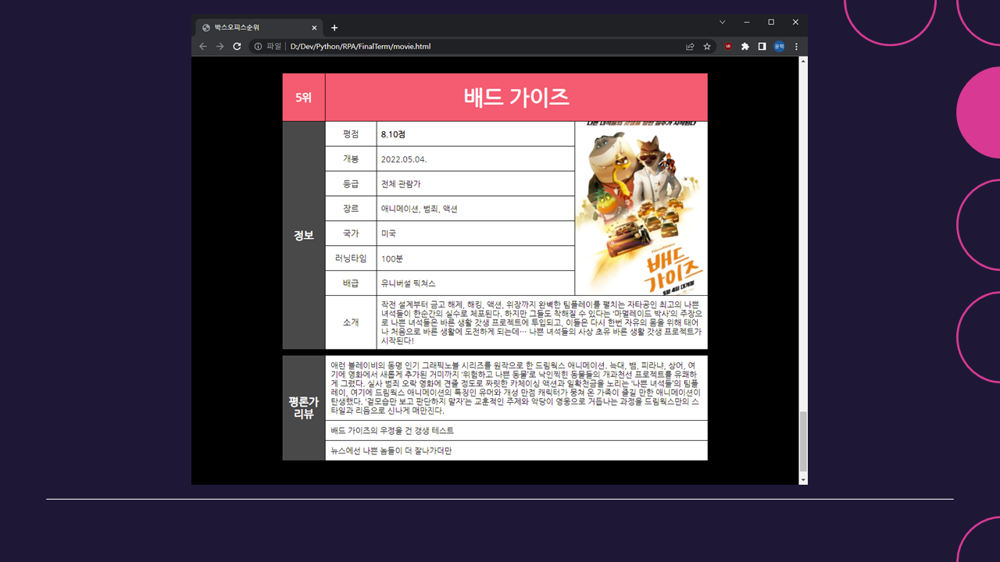
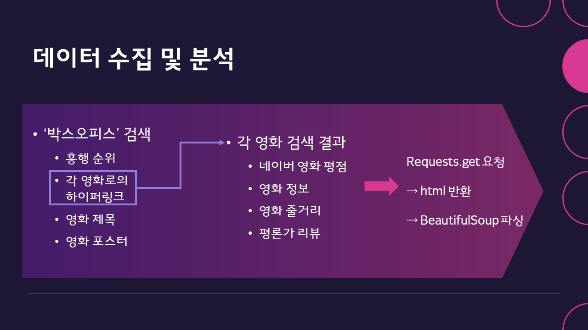
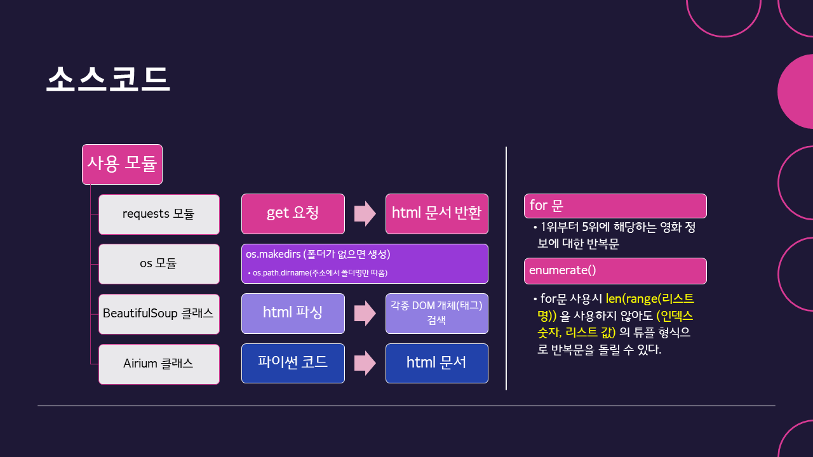
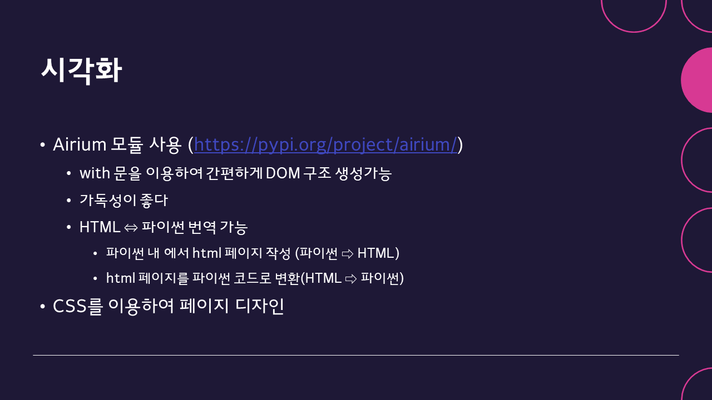
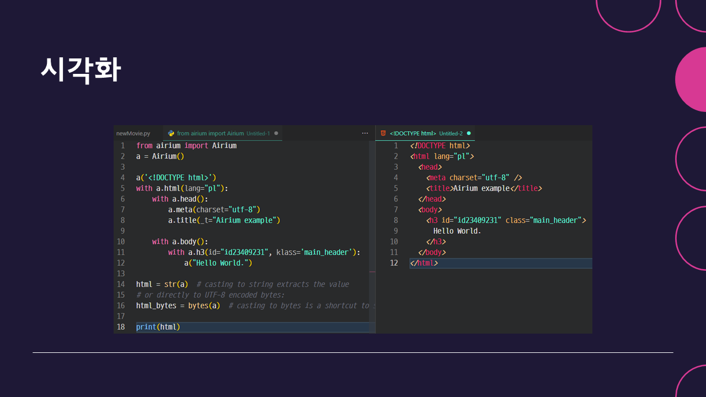

## About

This is the project for final term of "A wise daily life of Python with RPA" course. It uses `Python` with `Airium` module to fetch information of movie and produce into simple HTML single webpage.

Applied knowledges from "Introduction to Web Programming(`HTML+JS+CSS` course)" and "Introduction to coding got problem solving(`Python` course)" I took same semester.

Uses `Beautifulsoup, Airium` module.

## Slides

